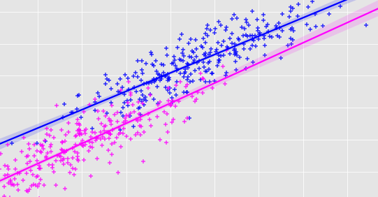

```{r setup, include = FALSE}
library(webexercises)
library(tinytex)
library(dplyr)
library(knitr)
library(ggplot2)
library(tidyverse)
library(openintro)
library(infer)
library(gridExtra)
library(HistData)
library(GGally)
library(broom)
knitr::opts_chunk$set(echo = TRUE)
```

```{r eval=FALSE, echo=FALSE}
install.packages("bookdown")
```

```{r include=FALSE, echo=FALSE}
knitr::write_bib(c(
  .packages(), 'bookdown', 'knitr', 'rmarkdown'
), 'packages.bib')
```

# Welcome to S1Z Lab 4

<br>

```{r graphic1, echo = FALSE, out.width = "50%", fig.cap = ""}

```

<br>

## Intended Learning Outcomes 

<br>

In this lab we explore *multiple regression*, which introduces the possibility of more than one predictor variable in a linear model. This builds on Lab 3 by adding in more than one predictor in the model.


This lab covers material in <a href="https://www.openintro.org/redirect.php?go=os4_tablet&referrer=/stat/os4.php#page=341">OpenIntro Chapter 9</a>.  Feel free to refer back to the material to help you within this lab. 

We will explore and visualise the data using the **tidyverse** suite of packages and analyse data contained in the **openintro** package.  We will use the **GGally** package to access the function `ggpairs` which produces a plot for each variable against each other displayed on one plot.

To run the code that appears in the consoles in this lab start by loading these packages.

```{r load-packages, echo=TRUE, eval=FALSE}
library(tidyverse)
library(openintro)
library(GGally)
library(broom)
```

To run the code that appears in the consoles in this lab in **your own version of RStudio**, make sure the packages above are installed. You can install packages using the `install.packages("package name")` command. For example, to install `tidyverse` you should run the line `install.packages("tidyverse")`.


